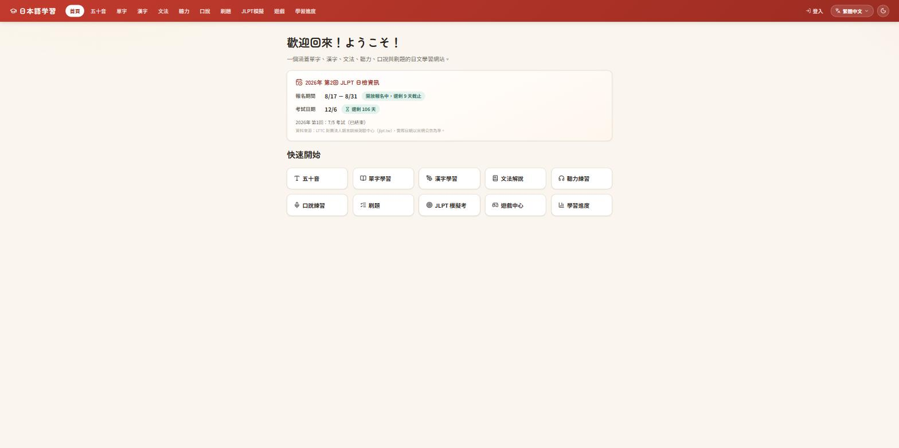
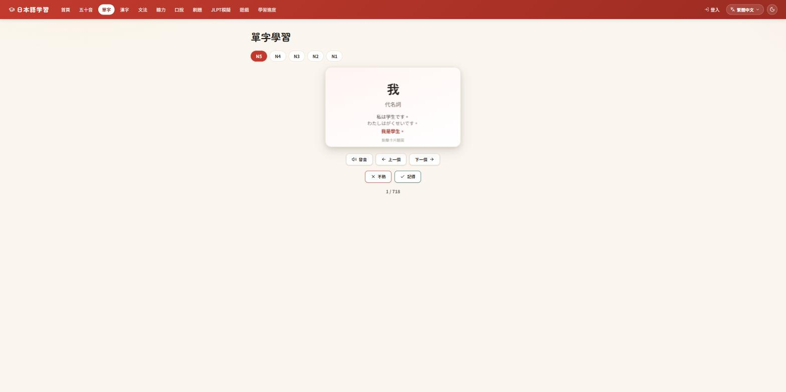
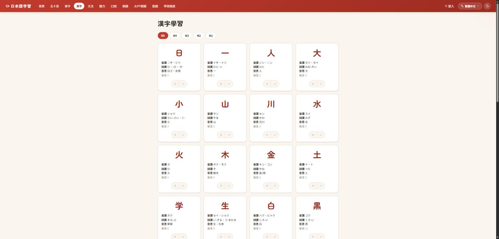
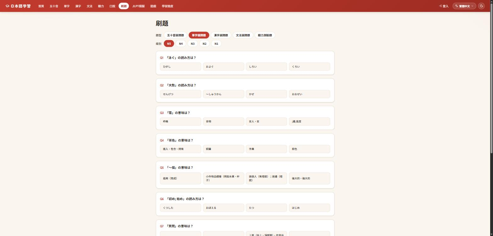

# J-learning

一個免費、開源的日文（JLPT）學習網站。React + Vite 前端，Node.js/Express + SQLite 後端，語音辨識與發音全部使用瀏覽器原生 Web Speech API，不依賴任何付費 API。

線上體驗：https://j-learning.matthewyu.uk

## 畫面截圖

<table>
  <tr>
    <td></td>
    <td></td>
  </tr>
  <tr>
    <td align="center">首頁</td>
    <td align="center">單字學習</td>
  </tr>
  <tr>
    <td></td>
    <td></td>
  </tr>
  <tr>
    <td align="center">漢字學習</td>
    <td align="center">刷題</td>
  </tr>
</table>

## 功能

- **五十音（假名）** 學習與測驗
- **單字學習**：依 JLPT 級別（N5–N1）分類，含例句、假名標音、中文翻譯
- **漢字學習**：讀音、意思、例句
- **文法**：文法點整理與例句
- **測驗（Quiz）**：單字 / 漢字 / 文法混合出題，即時計分
- **JLPT 模擬試題**：模擬正式考試題型
- **聽力練習**：使用瀏覽器 TTS（SpeechSynthesis）朗讀
- **口說練習**：使用瀏覽器語音辨識（SpeechRecognition）評分發音
- **寫作練習**
- **小遊戲**：輔助記憶的互動遊戲
- **學習進度追蹤**
- **多語系介面**：繁體中文、簡體中文（即時 OpenCC 轉換）、英文、韓文
- **深色模式**

## 技術架構

- **前端**：React 18、Vite、React Router，CSS variables 設計系統（含深色模式與多語系字型切換）
- **後端**：Node.js（ESM）、Express、better-sqlite3
- **翻譯**：
  - 繁體中文為網站原生語言
  - 簡體中文透過 `opencc-js` 即時轉換
  - 英文 / 韓文透過事先建置的翻譯快取（`server/data/translations.json`）
- **部署**：Cloudflare Tunnel

## 專案結構

```
.
├── client/          # React + Vite 前端
│   └── src/
│       ├── pages/       # 各功能頁面
│       ├── components/  # 共用元件（導覽列、下拉選單等）
│       └── i18n/        # 多語系字典與 Context
└── server/          # Express 後端
    ├── src/
    │   ├── routes/       # /api/* 路由
    │   ├── seed.js        # 資料種子（單字、漢字、文法）
    │   ├── locale.js      # 內容多語系翻譯
    │   └── translate.js   # 翻譯快取與批次翻譯客戶端
    ├── scripts/           # 一次性維運腳本（如建置翻譯快取）
    └── data/              # SQLite 資料庫與 JLPT 詞庫 CSV
```

## 本機開發

需求：Node.js 18+

### 後端

```bash
cd server
npm install
npm run seed   # 初始化資料庫（首次執行需要）
npm run dev    # http://localhost:4000
```

### 前端

```bash
cd client
npm install
npm run dev    # http://localhost:5173
```

### 建置正式版

```bash
cd client
npm run build   # 產出 client/dist
```

`server/src/index.js` 會自動將 `client/dist` 以靜態檔案方式服務，並提供 SPA fallback，因此正式環境只需啟動後端（`npm start`）即可同時服務前端與 API。

## 授權

MIT License，詳見 [LICENSE](./LICENSE)。
