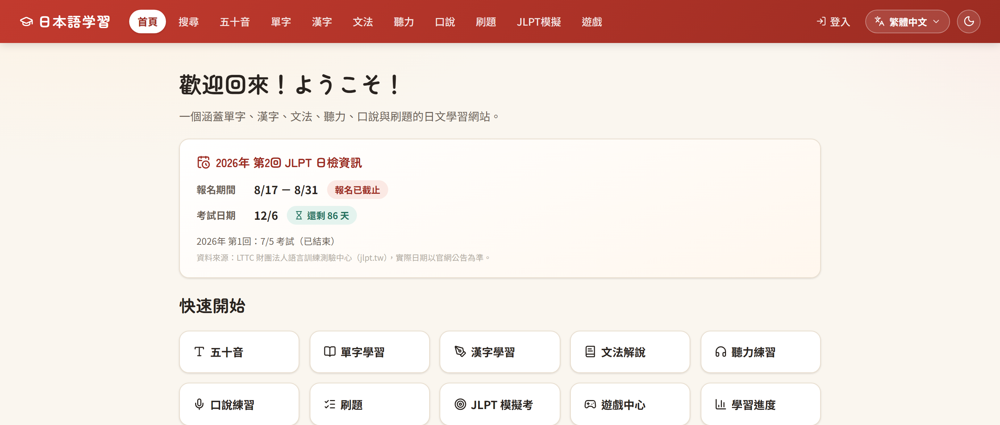
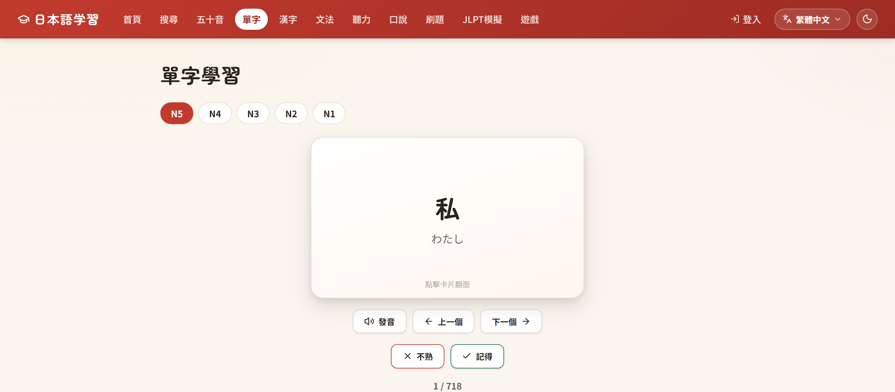
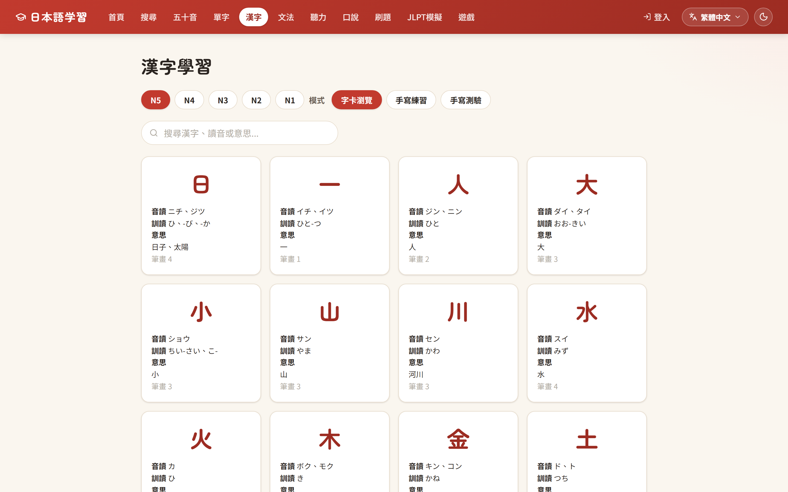
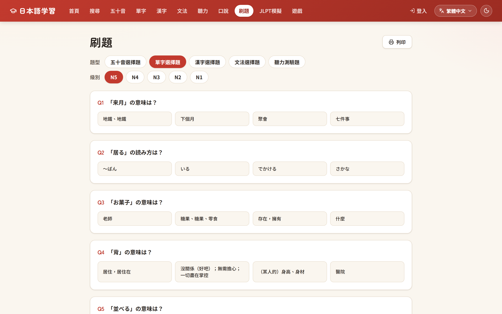
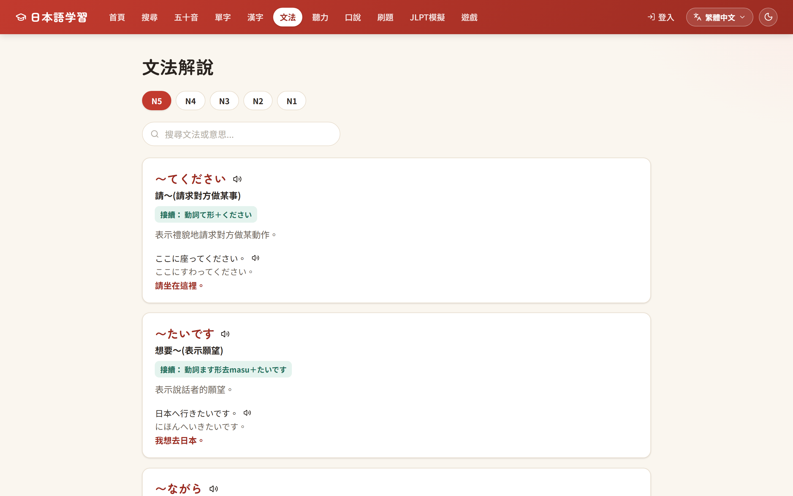
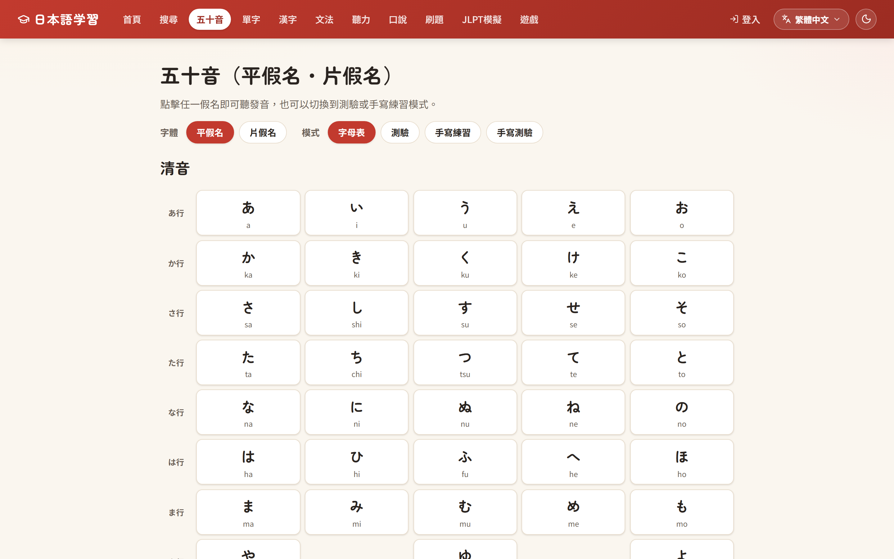

# 日本語学習 J-Learning

一個免費、開源的 JLPT 日文學習網站 — 單字、漢字、文法、聽力、口說與刷題，發音與語音辨識全部使用瀏覽器原生 Web Speech API，不依賴任何付費 API。

<p>
  <a href="https://j-learning.matthewyu.uk"></a>
  <a href="https://github.com/yuchiyang123/J-learning/actions/workflows/deploy.yml"></a>
  
  
  
  
</p>

**[🔗 線上體驗](https://j-learning.matthewyu.uk)**

## 截圖

<table>
  <tr>
    <td></td>
    <td></td>
  </tr>
  <tr>
    <td></td>
    <td></td>
  </tr>
  <tr>
    <td></td>
    <td></td>
  </tr>
</table>

## 功能

| 學習內容 | 練習與測驗 | 其他 |
|---|---|---|
| 五十音（清音／濁音／半濁音） | 刷題：單字／漢字／文法／五十音／聽力混合出題 | 多語系：繁中／簡中／英／韓 |
| 單字（N5–N1，例句＋假名標音＋中文翻譯） | JLPT 模擬試題 | 深色模式 |
| 漢字（音讀／訓讀／筆順動畫） | 聽力練習（TTS 朗讀） | 學習進度追蹤（SRS 間隔重複） |
| 文法（文法點＋例句，皆可發音） | 口說練習（語音辨識即時評分） | 小遊戲輔助記憶 |
| | 手寫練習與手寫測驗（五十音／漢字） | |

## 技術架構

- **前端** — React 18、Vite、React Router，CSS variables 設計系統（深色模式與多語系字型切換）
- **後端** — Node.js（ESM）、Express、better-sqlite3
- **語音** — 瀏覽器原生 Web Speech API（SpeechSynthesis + SpeechRecognition），無外部 TTS / ASR 服務
- **多語系** — 繁體中文為原生語言；簡體中文透過 `opencc-js` 即時轉換；英文／韓文使用預先建置的翻譯快取
- **部署** — Docker + Cloudflare Tunnel，GitHub Actions 自動部署

<details>
<summary>專案結構</summary>

```
.
├── client/          # React + Vite 前端
│   └── src/
│       ├── pages/       # 各功能頁面
│       ├── components/  # 共用元件（導覽列、下拉選單等）
│       └── i18n/        # 多語系字典與 Context
└── server/          # Express 後端
    ├── src/
    │   ├── routes/       # /api/* 路由
    │   ├── seed.js       # 資料種子（單字、漢字、文法）
    │   ├── locale.js     # 內容多語系翻譯
    │   └── translate.js  # 翻譯快取與批次翻譯客戶端
    ├── scripts/          # 一次性維運腳本
    └── data/             # SQLite 資料庫與 JLPT 詞庫 CSV
```

</details>

## 本機開發

需求：Node.js 18+

```bash
# 後端 — http://localhost:4000
cd server
npm install
npm run seed   # 初始化資料庫（首次執行需要）
npm run dev

# 前端 — http://localhost:5173
cd client
npm install
npm run dev
```

正式建置：`cd client && npm run build`。`server/src/index.js` 會自動將 `client/dist` 以靜態檔案服務並提供 SPA fallback，正式環境只需啟動後端（`npm start`）即可同時服務前端與 API。

## 授權

[MIT License](./LICENSE)
